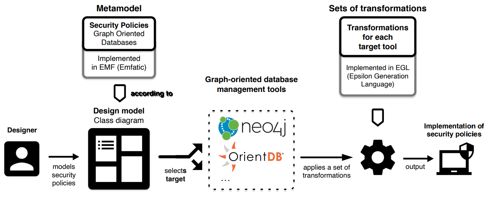

# GSYA-NoSQL

Design and implementation of security policies for NoSQL databases (documental, graph oriented and columnar).

## [Metamodels](metamodels/)

In order to apply a security by design approach, a set of metamodels have been defined to specify the security aspects at the NoSQL database design stage for:

- Graph-oriented databases
- Document databases
- Columnar databases

Furthermore, several example models (defined according to these metamodels) are provided. These metamodels and models have been implemented in an Eclipse project.

## Transformations 

On the other hand, a model-driven development approach is applied which, starting from these models, allows to automatically obtain the implementation of security policies in specific tools. For each target tool, the necessary scripts (in Python) are provided packaged in a Docker container.
- Graph-oriented databases
    - Neo4J -> [GraphModelToNeo4J](GraphModelToNeo4J/)
    - OrientDB

- Document databases
    - MongoDB
- Columnar databases
    - Cassandra