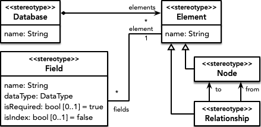
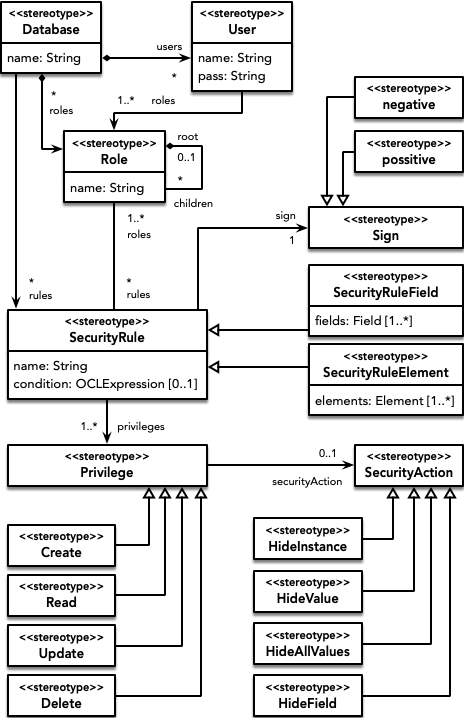
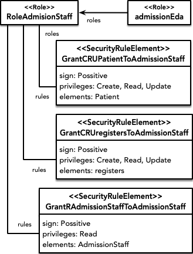

# An ontology-based secure design framework for graph-based databases

Design and implementation of security policies for NoSQL graph databases.

# Metamodel

When approaching security in NoSQL databases from a design point of view, we need on the one hand the structural aspects specific to the type of database (graph-oriented, document or columnar) and on the other hand the definition of security policies related with them, that can be independent and reusable for different types of NoSQL databases.

To assist in the design of security policies on graph-oriented databases, we present the following metamodels:

## Graph-oriented databases (structural concepts)

The metamodel for graph-oriented databases allows to establish all the necessary structural elements, so that a database has elements that can be Node or Relationship between two nodes. Both nodes and relationships can have associated Field with an associated DataType.

## Security policies on databases (regardless of their type)

The security metamodel allows establishing security policies on the database. To do so, it allows defining a set of security rules that grant or deny privileges (Create, Read, Update, Delete) on database elements to certain users. To classify database users, a role-based access control policy is used to define role hierarchies and associate users to them. This access control policy is the most widely used and supported by end tools. 
Security rules can be associated to database elements or fields of such elements (fine-grained). Depending on the type of NoSQL database we are using, these elements will refer to nodes and relationships, documents or columns.

## Transformations 

On the other hand, a model-driven development approach is applied which, starting from these models, allows to automatically obtain the implementation of security policies in specific tools. For each target tool, the necessary scripts (in Python) are provided packaged in a Docker container.

- Graph-oriented databases
    - Neo4J -> [GraphModelToNeo4J](GraphModelToNeo4J/)
    - OrientDB -> [GraphModelToOrientDB](GraphModelToOrientDB/)

# Models

Furthermore, several example models are provided. These metamodels and models have been implemented in an Eclipse project.

Case study related with the health domain, more specifically to the management of diagnostics, involving patients, doctors and associated treatments. 

Starting with the structural part, the following nodes, relationships and properties are defined. The administration staff (AdmissionStaff node) is in charge of registering patients (Patient node) and maintaining their associated information (name, address, social security number, etc.). Doctors (Doctor node) have an associated specialty and are in charge of diagnosing patients, so that patients have associated diseases (Disease node) diagnosed on a certain date by a certain doctor. In addition, each disease has a series of possible treatments associated with it (Treatment node), being the doctor the one who selects one of them as the current treatment that a certain patient suffering from that disease is following.

As for the security part, first it is decided to define a role for each type of user that will be able to interact with the system: administration staff (RoleAdmissionStaff), patients (RolePatient) and doctors (RoleDoctor). Next, for each of these roles, a set of authorizations are established that limit their privileges according to the security policy sought. Going into more detail, the following security rules are defined.

The patient role has a positive authorization defined for query doctors.

The admission staff role has several authorizations associated with it to grant privileges on nodes and relationships. On the one hand, read, create and update (not delete) privileges for patients and for the relationship that indicates that certain personnel have registered a certain patient. And on the other hand, to grant read privilege over the admission staff.

The doctor role presents two authorizations similar to those seen above, which grant several privileges on nodes and relationships. But in addition, it defines two fine-grained authorizations over properties. The first of these establishes a negative authorization that withdraws read permission over the patients' social security number (over which it had full read access). The second rule also refines access to patient information, this time withdrawing the privilege to read their addresses but only for those patients who are underage.

