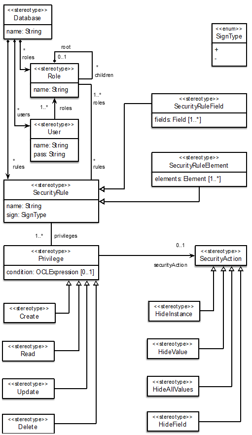
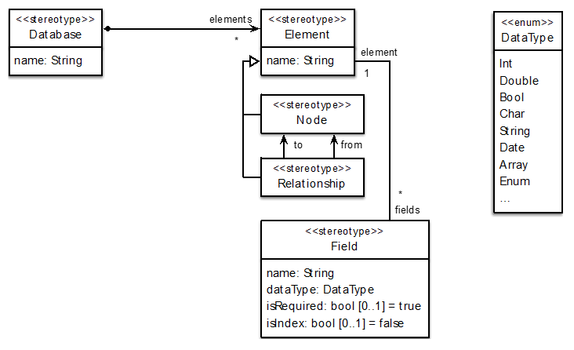
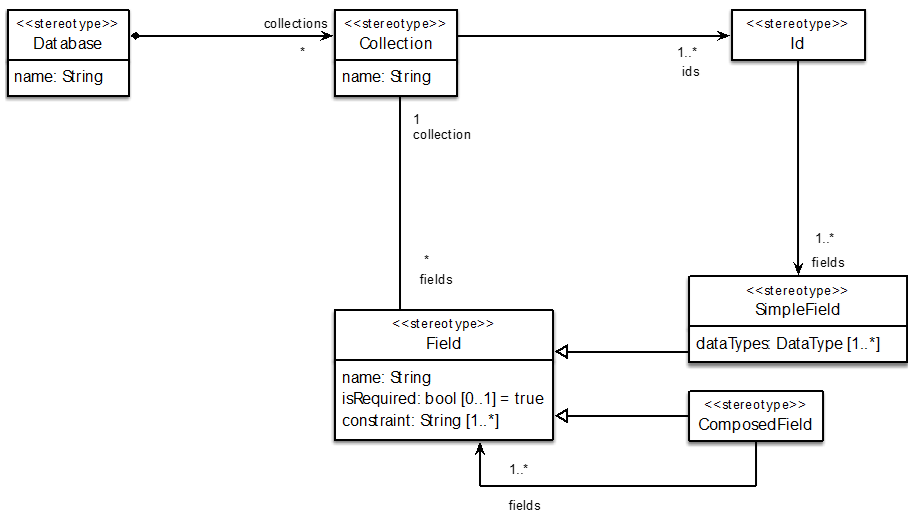

# GSYA-NoSQL

Metamodels for the design of security policies in NoSQL databases. These metamodels are defined in ecore in an Eclipse project.
- Security policies
- Structure of documental databases
- Structure of graph oriented databases
- Structure of columnar databases 

## Security policies

## Graph-oriented databases

## Document databases

## Columnar databases